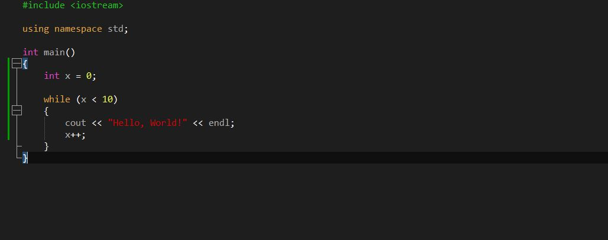

# Halloween
Personal dark theme for Notepad++

I tried to find a set of colours that didn't hurt the eyes in a long coding session and were pleasant to code with.
Feedback and constructive criticism is well accepted. Consider the following criteria when judging this theme:
1) Eye relaxation
2) Color comfort
3) Personal taste

To install this theme, drag and drop the XML file in the *C:\Users\Username\AppData\Roaming\Notepad++\themes* folder. 
To select this theme,  go in the *Settings -> Style Configuration* menu in Notepad++ and select the *"Halloween"* theme.

## List of the currently supported languages:
- ActionScript
- ADA
- ASP
- Assembly
- Bash
- Batch
- C
- Caml
- CMakeFile
- COBOL
- CSS
- C#
- C++
- HTML
- INI
- Java
- Javascript
- Lua
- Makefile
- Matlab
- PHP
- Python
- Ruby
- SQL
- VB
- XML
