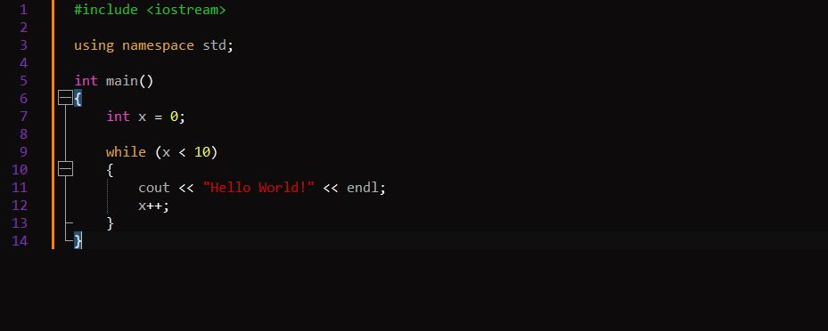

# Halloween
Personal dark theme for Notepad++

I tried to find a set of colours that didn't hurt the eyes in a long coding session and were pleasant to code with.
Feedback and constructive criticism is well accepted.

To install this theme, drag and drop the XML file in the `C:\Users\Username\AppData\Roaming\Notepad++\themes` folder. If you
also want to have .md support you have to put the `markdown._halloween.udl.xml` file in the `C:\Users\Username\AppData\Roaming\Notepad++\userDefineLangs` directory. 

To select this theme,  go in the `Settings -> Style Configuration` menu in Notepad++ and select the *"Halloween"* theme.

## List of the currently supported languages:
- ActionScript
- ADA
- ASP
- Assembly
- Bash
- Batch
- C
- Caml
- CMakeFile
- COBOL
- CSS
- C#
- C++
- D
- HTML
- INI
- Java
- Javascript
- JSON
- Lua
- Makefile
- Matlab
- PHP
- Python
- Ruby
- Rust
- SQL
- TeX
- TypeScript
- VB
- XML
